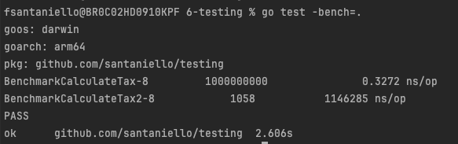

# Testing 

## Cobertura de Código

Para testar nossa cobertura de código, o Go fornece algumas ferramentas. 

O comando abaixo executa os testes unitários no pacote atual e coleta informações sobre a cobertura de código. A flag -coverprofile especifica que os dados de cobertura devem ser gravados em um arquivo chamado coverage.out. Este arquivo contém detalhes sobre quais linhas de código foram executadas durante os testes.
```bash
go test -coverprofile=coverage.out
```

Após gerar o arquivo de cobertura com o comando anterior, este comando é usado para visualizar os resultados de forma mais amigável. Ele lê o arquivo coverage.out e gera um relatório HTML que mostra quais linhas de código foram ou não cobertas pelos testes. O relatório é útil para entender quais partes do código precisam de mais testes para garantir uma boa cobertura.

```bash
go tool cover -html=coverage.out
```

## Benchmark

No go, temos uma ferramenta nativa para fazer benchmarks.

Abaixo, segue o padrão de um teste de benchmark: 

```go
func BenchmarkCalculateTax(b *testing.B) {
	for i := 0; i < b.N; i++ {
		CalculateTax(500.0)
	}
}
```

Repare que o test começa com a palavra Benchmark e aponta para testing.B e não testing.T como no caso do teste unitário.

Para rodar esse Benchmark, usamos o comando abaixo:

```bash
go test -bench=.
```

E a saida será a seguinte: 



- **goos** = Sistema Operacional que estamos usando
- **goarch** = Arquitetura do processador usado
- **pkg** = pacote que estamos utilizando
- **BenchmarkCalculateTax-8** = nome da função que estamos rodando - quantidade de nucleos computacionais (cpus) usadas para rodar esse teste.  
- **100000000** = quantidade de operações que ele conseguiu executar nessa função
- **0.3272 ns/op** = Quantas operações rodamos por nano segundo

### Melhorando o Benchmark

O comando de benchmark do go possui uma série de parãmetros que você pode passar para melhorar seus testes. Exemplo:

```bash
go test -bench=. -count 5 -run=^# -benchtime=5s
```

- **-count 5** Esta flag especifica que os benchmarks devem ser executados 5 vezes. Isso é útil para obter uma média mais consistente do desempenho, já que a execução de um único benchmark pode ser afetada por condições temporárias do sistema.
- **-run=^#** Normalmente, o comando go test executa tanto testes unitários quanto benchmarks. A flag -run é usada para especificar quais testes devem ser executados, usando uma expressão regular. O valor ^# é uma expressão regular que não corresponde a nenhum teste (pois testes começam com Test, não #), então essa flag efetivamente desativa a execução de testes unitários, deixando apenas os benchmarks.
- **-benchtime=5s** Esta flag define o tempo que cada benchmark individual deve ser executado. 5s significa que cada benchmark será executado por 5 segundos. Isso é útil para garantir que os benchmarks tenham tempo suficiente para mostrar uma tendência de desempenho sob carga sustentada.

## Testes de Mutação (Fuzzing

O fuzzing é uma técnica de teste de software que envolve a geração automática de dados de entrada aleatórios ou semi-aleatórios para um programa com o objetivo de encontrar bugs e vulnerabilidades. No contexto do Go (também conhecido como Golang), uma linguagem de programação popular, o fuzzing é usado para testar a robustez e segurança dos programas escritos nessa linguagem.

Aqui estão os aspectos chave dos testes de fuzzing em Go:

- Detecção de Bugs: Fuzzing é eficaz na descoberta de vários tipos de bugs, como buffer overflows, vazamentos de memória, panics e comportamentos inesperados que podem ser difíceis de encontrar com testes convencionais.

- Geração Automática de Dados: O fuzzing cria entradas de dados que são imprevisíveis e variadas. Isso inclui strings, números, ou estruturas de dados complexas, dependendo do que está sendo testado.

- Testes Robustos: Ao contrário dos testes unitários ou de integração que geralmente usam um conjunto fixo de entradas, o fuzzing pode revelar falhas que não são facilmente previsíveis, melhorando assim a robustez do software.

- Integração com o Go: A partir do Go 1.18, o suporte para fuzzing foi integrado diretamente na ferramenta padrão de teste do Go. Isso significa que você pode escrever testes de fuzzing como parte de seu conjunto de testes normal em Go.

- Uso de Corpus: O fuzzing em Go pode utilizar um "corpus" de entradas de teste conhecidas para iniciar o processo de fuzzing, expandindo-se a partir daí para gerar novas entradas.

- Identificação de Vulnerabilidades de Segurança: Além de encontrar bugs comuns, o fuzzing é particularmente útil para identificar vulnerabilidades de segurança, como injeções de código ou falhas que podem ser exploradas.

- Automatização e Integração Contínua: Os testes de fuzzing podem ser automatizados e integrados em pipelines de integração contínua, proporcionando testes contínuos durante o ciclo de desenvolvimento do software.

Exemplo:

```go
func FuzzCalculateTax(f *testing.F) {
	// Criando o valores de seed para "ensinar" quais tipos de dados nosso fuzzing deve gerar.
	seed := []float64{-1, -2, -2.5, 500.0, 1000.0, 1501.0}
	// Abaixo vamos alimentar nosso fuzzing
	for _, amount := range seed {
		f.Add(amount)
	}	
	// Abaixo executamos nosso fuzzing com todos os cenários elaborados pelo fuzzing
	f.Fuzz(func(t *testing.T, amount float64) {
		result := CalculateTax(amount)
		if amount <= 0 && result != 0 {
			t.Errorf("Reveived %f but expected 0", result)
		}
		if amount > 20000 && result != 20 {
			t.Errorf("Reveived %f but expected 20", result)
		}
	})
}
```

Caso algum erro ocorra, um arquivo na pasta FuzzCalculateTax será gerado com o cenário em que o erro foi encontrado
e após corrigi-lo, podemos executar aquele cenário novamente para saber se o mesmo foi corrigido:

```bash
go test -run=FuzzCalculateTax/5fb97e24f60a8962
```

**OBS:** O Go lança no console o comando para executar o teste como no caso do exemplo acima.

## Mocks

- [Documentação Mock Testify](https://pkg.go.dev/github.com/stretchr/testify/mock)
- [Usando Mockery para gerar os mocks automaticamente ao invés de usar testify](https://medium.com/@thegalang/testing-in-go-mocking-mvc-using-testify-and-mockery-c25344a88691)


