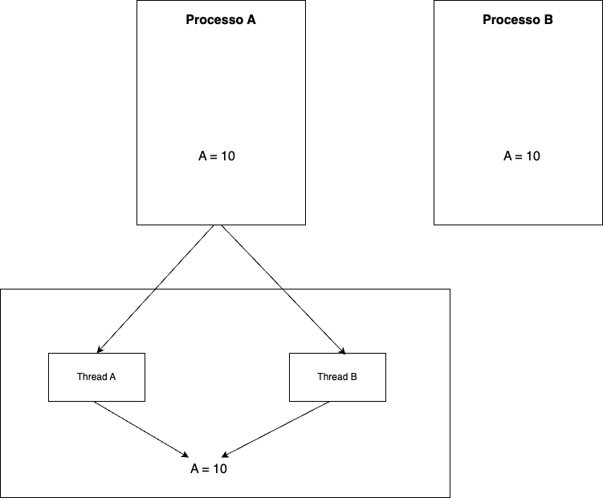
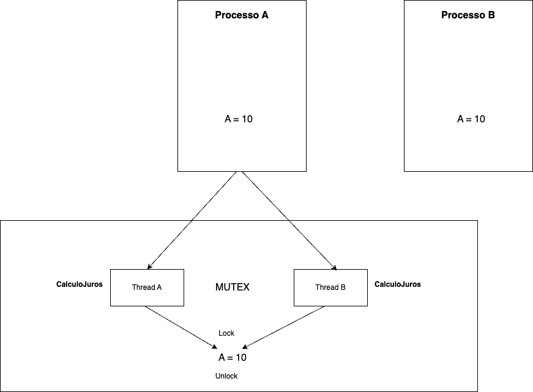
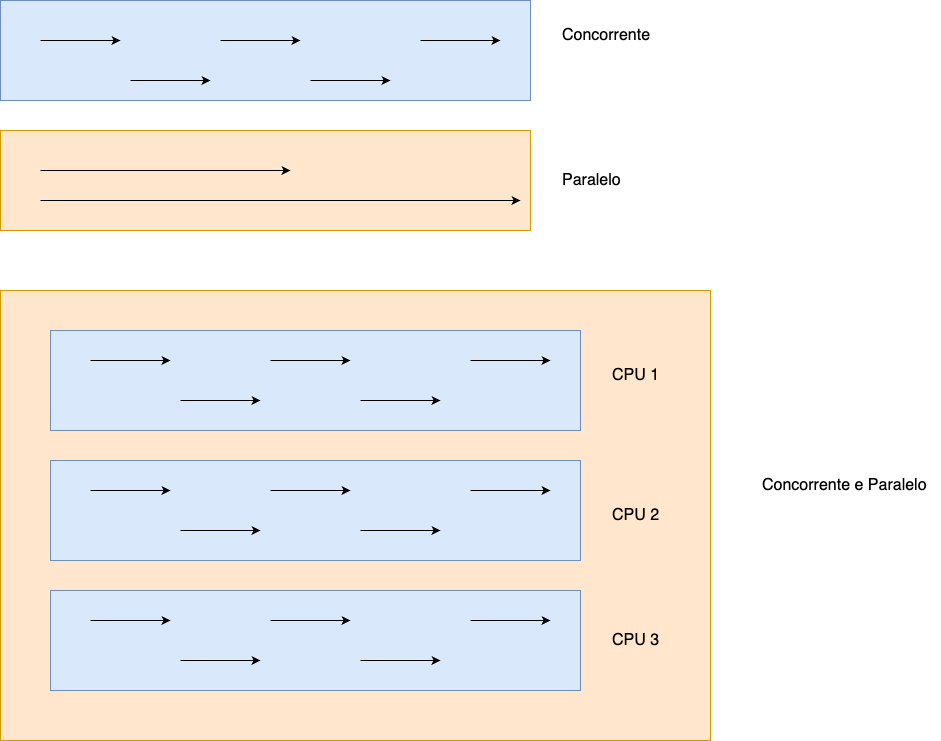
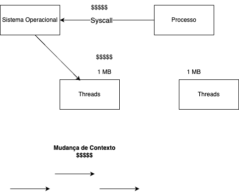

# Multithreading

## Processo X Threads

Um processo é uma instância de um programa de computador em execução. Quando você executa um programa, o sistema operacional aloca espaço na memória para aquele programa e cria um processo que contém todas as informações necessárias para gerenciar a execução do programa. Isso inclui o código do programa, variáveis, contadores de instruções, informações de estado e uma área de memória própria, conhecida como espaço de endereçamento do processo.

Cada processo é executado de forma isolada dos outros processos, o que significa que os recursos (memória, entradas de sistema de arquivos, dispositivos, etc.) de um processo não são compartilhados diretamente com outros processos. Isso ajuda a manter a estabilidade e a segurança do sistema operacional, pois os processos mal comportados ou mal-intencionados têm mais dificuldade em afetar outros processos.

Uma thread, por outro lado, é uma entidade mais leve que existe dentro de um processo. Um processo pode ter várias threads, todas compartilhando o mesmo espaço de endereçamento do processo pai, mas cada thread executa uma sequência independente de instruções. As threads de um mesmo processo podem executar tarefas em paralelo e compartilhar recursos, como dados na memória e arquivos abertos, o que as torna extremamente úteis para realizar várias tarefas ao mesmo tempo dentro do mesmo programa.

Threads são unidades básicas de utilização de CPU e cada thread tem seu próprio contador do programa, registro e pilha de chamadas, mas elas compartilham outros recursos do processo. O uso de múltiplas threads pode aumentar a eficiência do programa ao aproveitar os núcleos de processadores multithread ou multi-core disponíveis em muitos computadores modernos, permitindo que as tarefas sejam executadas de forma mais rápida e eficiente.

Em resumo, um processo é como um programa em execução com seu próprio espaço de memória isolado, enquanto uma thread é uma linha de execução dentro de um processo que pode compartilhar recursos e ser usada para realizar tarefas paralelas.

Abaixo, temos a ilutração de dois processos. O processo A que possui duas threads, a thread A e a thread B e que acessam a mesma váriavel A.



## Mutex e o controle de acesso um recurso compartilhado

Mutex, que é uma abreviação de "Mutual Exclusion object" (objeto de exclusão mútua), é um mecanismo de sincronização usado para controlar o acesso a um recurso compartilhado em ambientes de programação concorrentes. O conceito de mutex é essencial em sistemas operacionais e linguagens de programação que suportam multithreading para garantir que apenas uma thread (ou processo, em alguns casos) possa acessar um recurso ou seção de código crítico por vez.

Um mutex funciona da seguinte maneira:

1. **Bloqueio (lock):** Quando uma thread deseja entrar em uma seção crítica, ela tenta bloquear o mutex associado a essa seção. Se o mutex já estiver bloqueado por outra thread, a thread que está tentando adquirir o bloqueio será suspensa até que o mutex seja liberado.

2. **Seção Crítica:** Uma vez que a thread tem o mutex bloqueado, ela pode entrar e executar o código na seção crítica, que geralmente envolve acessar ou modificar recursos compartilhados.

3. **Liberação (unlock):** Quando a thread conclui sua tarefa na seção crítica, ela libera o mutex para que outras threads possam adquiri-lo e acessar a seção crítica.

Mutex são fundamentais para evitar race conditions, que ocorrem quando várias threads acessam e manipulam dados compartilhados simultaneamente, levando a resultados inesperados e potencialmente perigosos. Ao garantir a exclusão mútua, os mutex ajudam a manter a consistência dos dados e a integridade do programa.

Além disso, é importante gerenciar mutex com cuidado para evitar problemas comuns, como deadlocks, onde duas ou mais threads ficam bloqueadas indefinidamente, aguardando a liberação de mutexes que nunca ocorrerá.

Abaixo, segue uma breve ilustração de um mutex:



## Diferenças entre Concorrência e Paralelismo

Concorrência e paralelismo são conceitos relacionados à execução de múltiplas tarefas em sistemas de computador, mas têm diferenças importantes em como as tarefas são realizadas.

**Concorrência:**
Concorrência refere-se à capacidade de um sistema lidar com várias tarefas ao mesmo tempo. Em um sistema concorrente, várias tarefas podem estar em progresso em um dado momento, mas não necessariamente estão sendo processadas ao mesmo tempo. O processamento pode ser intercalado de forma que as tarefas avancem sem estar executando simultaneamente. Isso é especialmente útil em sistemas com um único processador ou núcleo, onde as tarefas são alternadas rapidamente (multitarefa), dando a impressão de que estão sendo realizadas simultaneamente.

**Paralelismo:**
Paralelismo, por outro lado, é quando tarefas múltiplas estão sendo executadas ao mesmo tempo em unidades de processamento separadas. Um sistema paralelo tira vantagem de múltiplos processadores ou núcleos para dividir uma tarefa em partes que podem ser processadas simultaneamente. O paralelismo pode ser alcançado em diferentes níveis, como múltiplos threads rodando em diferentes núcleos de um processador multicore, ou por distribuição de tarefas através de vários computadores em um cluster.

**Diferenças-chave:**
- **Execução:** Concorrência pode ocorrer em um única unidade de processamento através de alternância entre tarefas, enquanto paralelismo requer múltiplas unidades de processamento para executar tarefas ao mesmo tempo.
- **Escalabilidade:** O paralelismo se beneficia diretamente da adição de mais processadores ou núcleos, enquanto a concorrência se beneficia da organização eficiente e compartilhamento de recursos entre tarefas concorrentes.
- **Complexidade:** A gestão de tarefas em paralelo pode ser mais complexa, uma vez que requer coordenação e sincronização entre as unidades de processamento. A concorrência também tem seus desafios, especialmente quando se trata de compartilhamento de recursos e prevenção de condições de corrida, mas geralmente é mais simples de gerenciar do que o paralelismo puro.

Ambos os conceitos são aplicados na construção de sistemas de software modernos e sistemas operacionais para melhorar o desempenho e a eficiência, mas requerem técnicas cuidadosas de projeto e sincronização para prevenir problemas como condições de corrida, deadlocks e outros tipos de inconsistências.

### Concorrência e paralelismo em ambientes multicore

**Paralelismo em um ambiente multicore:**
Um sistema com múltiplos núcleos (multicore) permite que paralelismo verdadeiro ocorra, já que diferentes threads ou processos podem ser executados em núcleos separados ao mesmo tempo. Isto é, cada núcleo pode processar uma tarefa diferente simultaneamente, o que melhora significativamente a eficiência e a velocidade do processamento comparado com a execução em um único núcleo.

**Concorrência em um ambiente multicore:**
A concorrência se refere ao gerenciamento de múltiplas tarefas que podem ou não estar rodando simultaneamente. Em sistemas multicore, a concorrência ainda é relevante porque geralmente temos mais threads ou processos concorrentes do que núcleos disponíveis. O sistema operacional é responsável por agendar as tarefas (e.g., threads) entre os núcleos disponíveis, alternando entre eles conforme necessário para lidar com a carga de trabalho. Isso significa que enquanto algumas tarefas podem ser executadas em paralelo, outras podem estar aguardando para serem executadas ou serem intercaladas nos núcleos, demonstrando concorrência.

**Concorrência e Paralelismo Simultâneos:**
Quando um sistema multicore está executando um aplicativo multithreaded, pode haver múltiplas threads rodando em paralelo nos diferentes núcleos (paralelismo), enquanto outras threads - talvez do mesmo aplicativo ou de outros aplicativos - podem estar aguardando sua vez de executar ou sendo alternadas de forma concorrente. A presença de múltiplas CPUs ou núcleos permite que as threads sejam executadas verdadeiramente em paralelo, mas o sistema operacional ainda precisa gerenciar a concorrência, que ocorre devido à quantidade limitada de recursos computacionais comparada ao número de tarefas.

Assim, concorrência e paralelismo são conceitos que se complementam em sistemas multicore. A concorrência otimiza o uso de recursos em um sistema enquanto o paralelismo acelera a execução através do processamento simultâneo. A complexidade do desenvolvimento de software em tais sistemas aumenta devido à necessidade de gerenciar corretamente os recursos compartilhados em um ambiente onde várias tarefas estão sendo executadas, tanto concorrentemente quanto em paralelo.

**Paralelismo em um ambiente multicore:**
Um sistema com múltiplos núcleos (multicore) permite que paralelismo verdadeiro ocorra, já que diferentes threads ou processos podem ser executados em núcleos separados ao mesmo tempo. Isto é, cada núcleo pode processar uma tarefa diferente simultaneamente, o que melhora significativamente a eficiência e a velocidade do processamento comparado com a execução em um único núcleo.

**Concorrência em um ambiente multicore:**
A concorrência se refere ao gerenciamento de múltiplas tarefas que podem ou não estar rodando simultaneamente. Em sistemas multicore, a concorrência ainda é relevante porque geralmente temos mais threads ou processos concorrentes do que núcleos disponíveis. O sistema operacional é responsável por agendar as tarefas (e.g., threads) entre os núcleos disponíveis, alternando entre eles conforme necessário para lidar com a carga de trabalho. Isso significa que enquanto algumas tarefas podem ser executadas em paralelo, outras podem estar aguardando para serem executadas ou serem intercaladas nos núcleos, demonstrando concorrência.

**Concorrência e Paralelismo Simultâneos:**
Quando um sistema multicore está executando um aplicativo multithreaded, pode haver múltiplas threads rodando em paralelo nos diferentes núcleos (paralelismo), enquanto outras threads - talvez do mesmo aplicativo ou de outros aplicativos - podem estar aguardando sua vez de executar ou sendo alternadas de forma concorrente. A presença de múltiplas CPUs ou núcleos permite que as threads sejam executadas verdadeiramente em paralelo, mas o sistema operacional ainda precisa gerenciar a concorrência, que ocorre devido à quantidade limitada de recursos computacionais comparada ao número de tarefas.

Assim, concorrência e paralelismo são conceitos que se complementam em sistemas multicore. A concorrência otimiza o uso de recursos em um sistema enquanto o paralelismo acelera a execução através do processamento simultâneo. A complexidade do desenvolvimento de software em tais sistemas aumenta devido à necessidade de gerenciar corretamente os recursos compartilhados em um ambiente onde várias tarefas estão sendo executadas, tanto concorrentemente quanto em paralelo.

Abaixo, segue uma breve ilustração de concorrência e paralelismo:



## Multithreading

A criação de uma thread a partir de um processo é uma operação que permite a um processo dividir-se em duas ou mais sequências de execução concorrentes – essas são as threads. O processo é conhecido como "multi-threading" ou "multithreading". Abaixo está uma descrição de alto nível de como isso funciona dentro de um sistema operacional moderno:

1. Chamada de sistema: Um programa que já está em execução (um processo) pode solicitar a criação de novas threads usando uma chamada de sistema apropriada. Em diferentes linguagens de programação e sistemas operacionais, isso pode ser feito com funções ou métodos variados, como `pthread_create` no POSIX (Linux, macOS), `CreateThread` no Windows ou métodos da classe `Thread` em Java.

2. Criação da thread: Quando a chamada de sistema é feita, o sistema operacional aloca os recursos necessários para a nova thread. Cada thread em um processo compartilha o mesmo espaço de endereçamento de memória (o que significa que têm acesso às mesmas variáveis e estruturas de dados), mas possui seu próprio contador de programa, registros e pilha.

3. Atribuição de identificador: O sistema operacional atribui um identificador (ID) único à nova thread para que possa ser gerenciada e referenciada separadamente de outras threads.

4. Inicialização de contexto: A thread é inicializada com um certo contexto de execução, ou seja, definem-se os valores iniciais para o contador de programa (normalmente apontando para a função que a thread executará), o estado dos registradores e cria-se uma pilha de execução dedicada.

5. Estado de prontidão: Após a sua criação, a thread é geralmente colocada no estado de prontidão (ready), aguardando o escalonador do sistema operacional alocar um processador (CPU core) para que ela possa começar a sua execução.

6. Execução: Quando o escalonador de threads do sistema operacional decide que é a vez da thread recém-criada ser executada, ele configura o hardware para que o contexto da thread seja carregado e então a execução começa. A partir desse momento, a thread executa em paralelo com outras threads (incluindo as do mesmo processo ou de outros processos) dependendo do número de núcleos de CPU disponíveis e da política do escalonador.

7. Término: Uma thread pode terminar sua execução de várias maneiras, como concluindo a função que estava executando, chamando explicitamente uma função para se auto-terminar (como `pthread_exit` no POSIX ou `ExitThread` no Windows), ou sendo terminada por outra thread.

8. Limpeza: Uma vez que uma thread terminou sua execução, algumas de suas estruturas de dados e recursos precisam ser limpos e desalocados pelo sistema operacional. Dependendo da implementação e da linguagem, pode ser necessário que outra thread no processo (como a thread principal) realize alguma operação de limpeza, como juntar-se à thread terminada usando `pthread_join` em ambientes POSIX, para que os recursos possam ser liberados completamente.

Utilizando esse modelo de multi-threading, os programas podem realizar múltiplas tarefas em paralelo, aumentando a eficiência e a responsividade do software em sistemas multitarefa e multi-core.

Abaixo, segue uma ilustração de como o multi-threading funciona em um sistema operacional moderno:



### Mudança de contexto

A mudança de contexto, conhecida em inglês como "context switch", é um processo fundamental em um sistema operacional multitarefa. Refere-se à capacidade do sistema de alternar a execução da CPU de um thread ou processo para outro.

A mudança de contexto ocorre no seguinte cenário: quando um processo ou thread (a unidade de execução dentro de um processo) está rodando em uma CPU e o sistema operacional precisa suspender sua execução para dar vez a outro processo ou thread. Isso pode ocorrer por diversos motivos, tais como:

- **Escalonamento de tempo compartilhado**: A maioria dos sistemas operacionais usa algum tipo de escalonamento preemptivo de tempo compartilhado, onde cada processo ou thread recebe um pequeno intervalo de tempo, chamado de fatia de tempo ou "time slice", para rodar. Quando esse intervalo de tempo expira, o processo ou thread atual é suspenso para que outro possa executar.
- **Espera I/O**: Quando um processo ou thread está esperando que uma operação de entrada/saída (I/O) seja concluída, ele pode ser suspenso, permitindo que outros processos ou threads usem a CPU.
- **Prioridade mais alta**: Se um processo ou thread com prioridade mais alta estiver pronto para executar, o sistema operacional pode pré-emptar o processo ou thread atual.
- **Interrupções e sinais**: Interrupções de hardware ou sinais de software podem fazer com que o sistema operacional mude o contexto para lidar com esses eventos imediatamente.

O processo de mudança de contexto envolve várias etapas:

1. **Salvar o contexto do processo/thread atual**: O estado da CPU precisa ser preservado para que o processo ou thread possa continuar de onde parou. Isso inclui o salvamento do contador de programa (PC), registradores, flags e possivelmente outras informações específicas da arquitetura da CPU.

2. **Escolher o próximo processo/thread a ser executado**: O escalonador do sistema operacional decide qual processo ou thread deve executar em seguida, com base em políticas de escalonamento e prioridades.

3. **Carregar o novo contexto**: O estado da CPU é restaurado para o processo ou thread selecionado. Isso significa carregar todos os valores salvos para o contador de programa, registradores, flags, etc., para que esse novo thread ou processo possa começar a ser executado.

As mudanças de contexto têm um custo em termos de desempenho, pois envolvem tempo de CPU para salvar e restaurar os estados de execução e não fazem progresso real no trabalho dos processos ou threads. Por isso, os sistemas operacionais são projetados para minimizar a frequência das mudanças de contexto e tornar o processo de mudança o mais rápido possível.

### Scheduler

Um scheduler (ou escalonador) é um componente crítico de um sistema operacional responsável por determinar qual processo ou thread deve utilizar a CPU e por quanto tempo. A eficiência, a responsividade e a justiça do sistema operacional dependem fortemente do algoritmo de escalonamento utilizado. Existem vários tipos de schedulers, cada um com seu próprio conjunto de políticas e algoritmos.

#### Tipos de schedulers

**Scheduler Preemptivo:**

- Controle: O sistema operacional tem total controle sobre a troca de processos na CPU. Um processo pode ser interrompido e substituído por outro a qualquer momento.
- Preempção: Um processo em execução pode ser interrompido por um processo de maior prioridade ou quando seu quantum (tempo de execução alocado) expira.
- Tempo-Real: É geralmente empregado em sistemas operacionais de tempo real, onde o cumprimento de prazos é crucial.
- Resposta: Fornecem melhor tempo de resposta, pois o sistema operacional pode rapidamente alternar entre processos para gerenciar recursos de forma eficaz.
- Complexidade: Algoritmos preemptivos são mais complexos em termos de implementação, uma vez que exigem que o estado do processo interrompido seja salvado para que ele possa ser retomado mais tarde.
- Problemas potenciais: Pode levar a condições de corrida (race conditions) e deadlocks se o acesso a recursos compartilhados não for cuidadosamente gerenciado.

**Scheduler Cooperativo (ou Não-Preemptivo):**

- Controle: Os processos controlam a passagem do controle de execução. Um processo mantém a CPU até que ele libere voluntariamente o controle ou bloqueie esperando por um evento de I/O.
- Voluntário: Um processo em execução continua sua execução até que ele mesmo decida desistir da CPU, normalmente após concluir sua tarefa ou quando precisa esperar por um evento externo.
- Simplicidade: Algoritmos cooperativos são mais simples de implementar, pois não há necessidade de salvar e restaurar estados frequentemente.
- Problemas de desempenho: Se um processo é mal comportado ou entra em um loop infinito, pode monopolizar a CPU, afetando o tempo de resposta de outros processos e a responsividade do sistema.
- Menor risco de problemas de concorrência: Como os processos só trocam de contexto quando decidem fazê-lo, o risco de condições de corrida é menor.

Resumindo, em um sistema com scheduler preemptivo, o sistema operacional toma decisões ativamente sobre quais processos devem ser executados e por quanto tempo, mesmo que isso signifique interromper um processo em execução. Já em um sistema com scheduler cooperativo, essa decisão é deixada aos processos, e o sistema operacional só intervém quando um processo cede explicitamente a CPU ou quando precisa esperar por um evento de I/O.

Os sistemas operacionais modernos geralmente utilizam um escalonamento preemptivo, pois isso permite um melhor gerenciamento de multitarefa e uma experiência de usuário mais responsiva. No entanto, existem cenários, como em sistemas embarcados simples ou em ambientes altamente controlados, onde o escalonamento cooperativo pode ser adequado.

## Multithreading em GO

A linguagem GO tem seu próprio sistema de criação de threads (essas threads são chamadas de green threads) que utiliza o próprio RUNTIME da linguagem não realizando uma chamada ao sistema operacional para a criação de threads. Isso faz com que a criação de threads em GO seja mais rápida e mais barata que em outras linguagens, como C ou C++. 

O custo de uma thread em GO é muito mais barato pois uma thread criado de modo convencional custa por default 1MB de memória, enquanto em GO o custo é de 2KB de memória. 

O GO tem seu próprio Scheduler e o mesmo trabalha de maneira cooperativa por default porém em alguns casos ele pode trabalhar de maneira preemptiva caso um processamento seja muito demorado.

O GO é feito para trabalhar de maneira concorrente.

### GO Routines

As GO Routines são as threads do GO. Elas são leves e podem ser criadas de maneira muito rápida. Elas são criadas utilizando a keyword go seguida da função que será executada pela thread. Elas são executadas de maneira concorrente.


### Wait Groups

Em Go (ou Golang), um `sync.WaitGroup` é uma estrutura de controle fornecida pelo pacote `sync` que é usada para sincronizar a execução de múltiplas goroutines. Um `WaitGroup` espera por uma coleção de goroutines terminarem sua execução antes de continuar a execução do programa.

Um `WaitGroup` tem três métodos principais:

1. `Add(int)`: Este método é usado para adicionar um contador ao `WaitGroup`. O valor passado para `Add` representa quantas goroutines o `WaitGroup` deve esperar. Normalmente, você invoca `Add(1)` antes de iniciar cada goroutine se pretende que o `WaitGroup` espere por essa goroutine.

2. `Done()`: Este método é chamado por uma goroutine quando ela completou seu trabalho. Nomeadamente, ele decrementa o contador do `WaitGroup` por um. `Done()` é geralmente deferido (`defer wg.Done()`) no início da goroutine para garantir que seja chamado quando a goroutine finaliza, independentemente de ela terminar normalmente ou por um panic.

3. `Wait()`: Este método bloqueia a execução até que o contador interno do `WaitGroup` chegue a zero, o que significa que todas as goroutines que foram adicionadas ao `WaitGroup` chamaram `Done()` e completaram sua execução.

Um exemplo básico de como usar um `WaitGroup`:

```go
package main

import (
	"fmt"
	"sync"
)

func main() {
	var wg sync.WaitGroup

	for i := 0; i < 5; i++ {
		wg.Add(1) // Adiciona uma contagem para cada goroutine a ser esperada
		go func(i int) {
			defer wg.Done() // Decrementa a contagem do WaitGroup quando a goroutine terminar
			fmt.Println("Goroutine", i, "completed")
		}(i)
	}

	// Espera que todas as goroutines chamem Done()
	wg.Wait()
	fmt.Println("Todas as goroutines terminaram a execução")
}
```

O uso de `WaitGroup` é especialmente útil quando você precisa coordenar a execução de múltiplas operações paralelas e deseja garantir que todas tenham sido completadas antes de prosseguir com o próximo passo em seu programa.

### Simulando problema de concorrência

Para analisarmos se nossa app tem ou não problemas de concorrência, podemos inicia-la com a opção -race. Segue exemplo:

```go
go run -race main.go   
```

Para testar a concorrencia, podemos utilizar a ferramenta apache bench, que é uma ferramenta de benchmarking para testar a performance de servidores HTTP. Segue exemplo:

```bash
ab -n 10000 -c 100 http://localhost:3000/  
```

No comando acima, estamos testando 1000 requisições com 100 usuários simultâneos. O resultado deveria ser algo parecido com o abaixo:

```bash
Você é o visitante número: 10001% 
```

Para resolver o problema de concorrência, podemos adotar 2 abordagens:

- Mutex (Lock e Unlock de variaveis);
- Variaveis atomicas (atomic package).

## Channels

Em Go, "channels" são um recurso fundamental que permite a comunicação entre goroutines, que são unidades de execução leves, semelhantes a threads, mas gerenciadas pela própria linguagem Go, em vez do sistema operacional. Os channels permitem o envio e recebimento de valores entre goroutines de maneira segura e sincronizada, facilitando a programação concorrente e paralela.

Os channels podem ser pensados como tubos ou condutos através dos quais os dados fluem. Uma goroutine pode enviar dados para um channel, enquanto outra goroutine pode receber esses dados do mesmo channel. Esse mecanismo de comunicação garante que os dados sejam transferidos de maneira segura, evitando condições de corrida e garantindo que os dados não sejam corrompidos ou perdidos.

Há alguns pontos chave sobre os channels em Go:

- Criação: Um channel é criado usando a função embutida make. Por exemplo, ch := make(chan int) cria um channel que transporta inteiros.

- Envio e recebimento: Para enviar um valor para um channel, usa-se o operador de envio, <-. Por exemplo, ch <- 10 envia o valor 10 para o channel ch. Para receber um valor de um channel, o operador <- é usado à esquerda de um channel. Por exemplo, value := <- ch recebe um valor de ch.

- Bloqueio: As operações de envio e recebimento são bloqueantes por padrão. Uma operação de envio bloqueia a goroutine emissora até que outro goroutine receba do channel. Da mesma forma, uma operação de recebimento bloqueia até que um valor seja enviado para o channel.

- Bufferização: Channels podem ser bufferizados, o que significa que eles podem armazenar várias mensagens em uma fila interna. Isso é especificado durante a criação do channel, por exemplo, ch := make(chan int, 100) cria um channel bufferizado com capacidade para 100 inteiros. Operações de envio em um channel bufferizado só bloqueiam quando o buffer está cheio, e operações de recebimento só bloqueiam quando o buffer está vazio.

- Fechamento: Um channel pode ser fechado para indicar que não serão enviados mais valores. Isso é feito com a função close, por exemplo, close(ch). Receber de um channel fechado retorna imediatamente o valor zero do tipo do channel.

Os channels são uma parte integrante da filosofia de "compartilhamento de memória por comunicação" do Go, contrastando com o modelo de "comunicação por compartilhamento de memória" usado em muitas outras linguagens de programação para gerenciamento de concorrência. Eles são fundamentais para escrever programas concorrentes e paralelos claros, concisos e corretos em Go.
